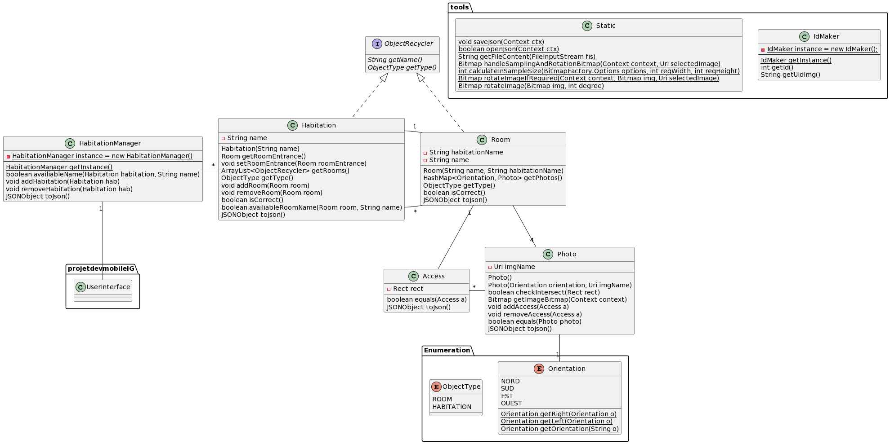

# Application

This app was made during my fifth semester in my computer science university : Faculté des Sciences et Technologies de Vandoeuvre-lès-Nancy (54500 France)

## Description

With this Android application you can map multiple habitation by taking four picture per room and draw doors on them.

To map your habitation, you must :
- Create the desired rooms
- Define the entrance
- Connect the rooms with doors if you have at least two rooms

Once you have mapped your habitation, you can visit it by sliding the pictures and clicking the doors.

## Availiable languages 

- French
- English

## Build Dependencies

- OS : Android
- Android Gradle Plugin Version : 7.3.1
- Gradle version : 7.4
- Target SDK Version : API 32 (Android 12L (Sv2))
- Min SDK Version : API 21 (Android 5.0 (Lollipop))

## Class diagram

## Author
[LESNIAK Louis](https://github.com/LESNIAK-Louis)

